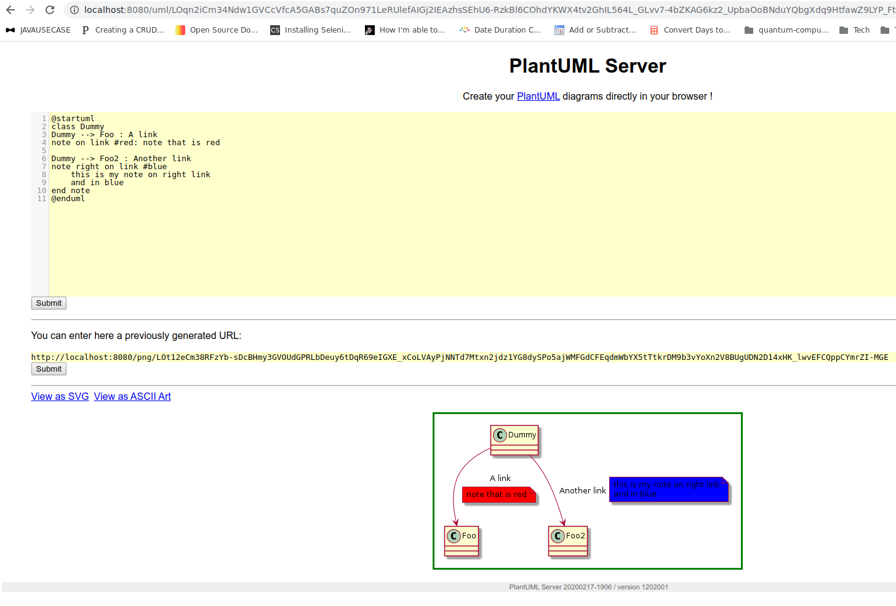
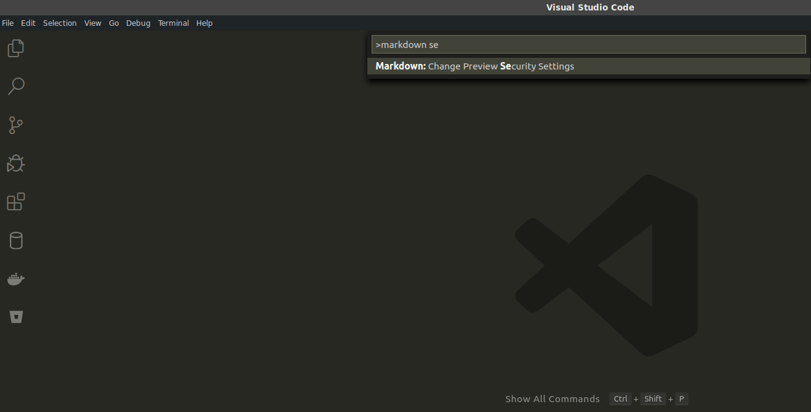
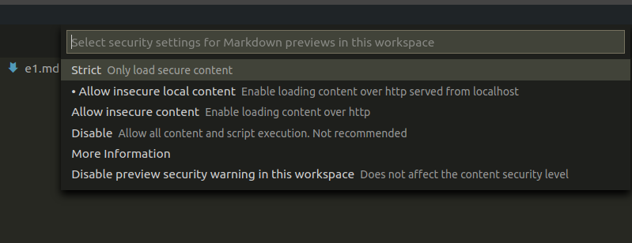
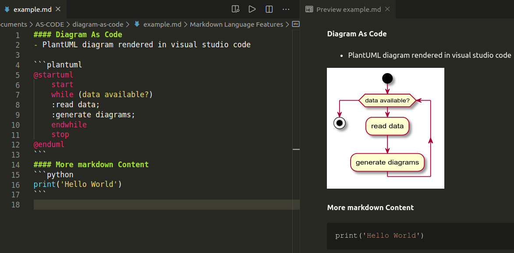

### PlantUML Diagram embedded inside a Markdown file

#### Step 1: Install PlantUML extension from MarketPlace

https://marketplace.visualstudio.com/items?itemName=jebbs.plantuml

#### Step 2:Configure the extension
- Open user setting and configure like
`CTRL + Shift + P`

```json
"plantuml.server": "http://localhost:8080",
"plantuml.render": "PlantUMLServer"
```

#### Step 3:Pull and run docker image for plantUML Server

- *pull plantUML server docker image*
* https://hub.docker.com/r/plantuml/plantuml-server/  
```bash
$ docker pull plantuml/plantuml-server
```

- *run plantUML server docker container*

```bash
$ docker run -d -p 8080:8080 plantuml/plantuml-server:tomcat
```
If using jetty server then
```bash
$ docker run -d -p 8080:8080 plantuml/plantuml-server:jetty
```
- The server is now listing to `http://localhost:8080.`



You may get an error for instance if port `8080` is used by another app e.g jenkins

- Follow these steps to change the jenkins server port to something else like port `8181`

- You can go to */etc/default/jenkins*  i.e `sudo gedit  /etc/default/jenkins`

- add `--httpPort=8181` or whatever port to JENKINS_ARGS e.g change wherever there appears `8080` to `8181`

- Then you should restart Jenkins with `sudo service jenkins restart`


#### Step 4: Enable Markdown Preview to include data from unsafe sources

The PlantUML images are served over `http://` and you should allow your preview to include data from unsafe sources.


Press `CTRL + Shift + P`

- *Open markdown preview security settings*




- *Allow insecure content*



- *Example Rendered Document*
  
- To test it out create an `example.md` file with PlantUML content.



The image is rendered on the fly


#### Step 5: Convert Markdown document with embedded PlantUML to HTML file
